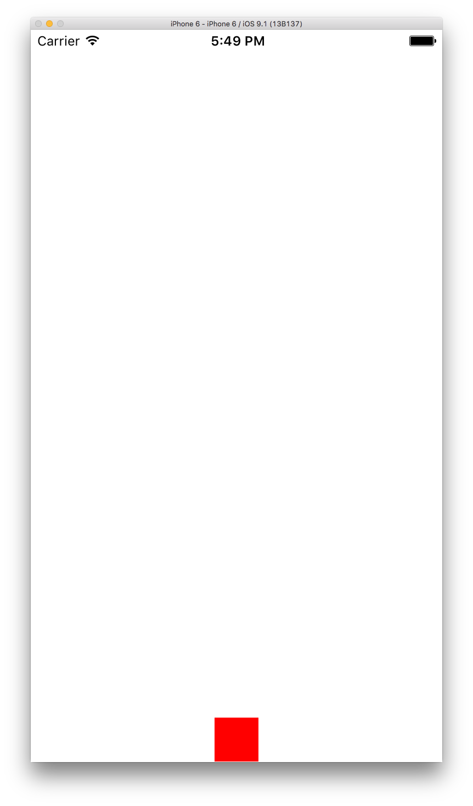
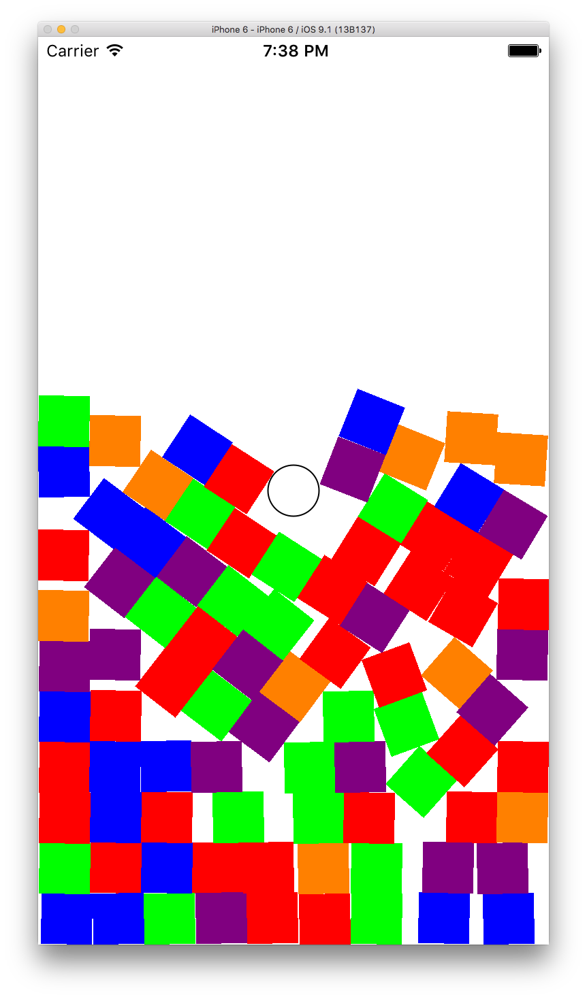

# Developing iOS 8 Apps with Swift

### Stanford University Class CS193P - Winter 2015
Code samples in this repository are created from demos done during classes held by Paul Hegarty of Stanford University during CS193P Winter 2015 Lectures. Some samples and resources are downloaded from [CS193P official website](http://web.stanford.edu/class/cs193p/cgi-bin/drupal/). To watch lectures see [iTunes](https://itunes.apple.com/us/course/developing-ios-8-apps-swift/id961180099)

CS193P is iOS Application Development course taught at Stanford by Paul Hegarty. Winter 2015 covers iOS8 development using Swift and Xcode 6.

### Screenshots
#### Autolayout

#### Bouncer

#### Breakout

#### Calculator

#### Cassini

#### Dropit

#### Hapiness

#### Psychologist

#### ShowSizeClass

#### Smashtag

#### Trax

### License
This work by Stanford University is licensed under a [Creative Commons Attribution-Noncommercial-Share Alike 3.0 United States License](http://creativecommons.org/licenses/by-nc-sa/3.0/us/). Based on a work at [cs193p.stanford.edu](http://cs193p.stanford.edu/)
